<div align="center">

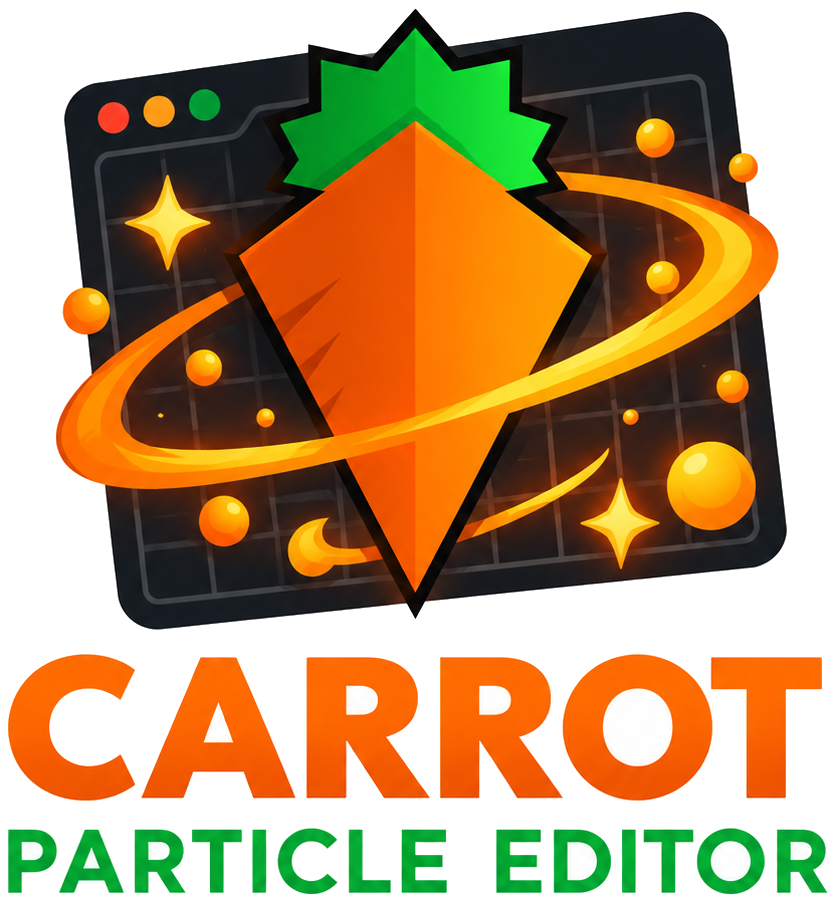

# Lempo Particle Editor

**Design stunning 2D & 3D particle effects visually — and play them in GDevelop.**

A standalone desktop editor with real-time GPU preview, paired with the **Advanced Particle Emitter** extension for GDevelop.

[](https://github.com/Boy1developer/Lempo-Particle-Editor/releases)
[](LICENSE)
[](https://github.com/Boy1developer/Lempo-Particle-Editor/releases)
[](https://gdevelop.io)
[](https://www.youtube.com/@EG_dev)

[**⬇️ Download**](https://github.com/Boy1developer/Lempo-Particle-Editor/releases) ·
[**✨ Features**](#-features) ·
[**🚀 Quick Start**](#-quick-start) ·
[**🎨 Blend Modes**](#-blend-modes) ·
[**🛣️ Roadmap**](#️-roadmap)

<br>

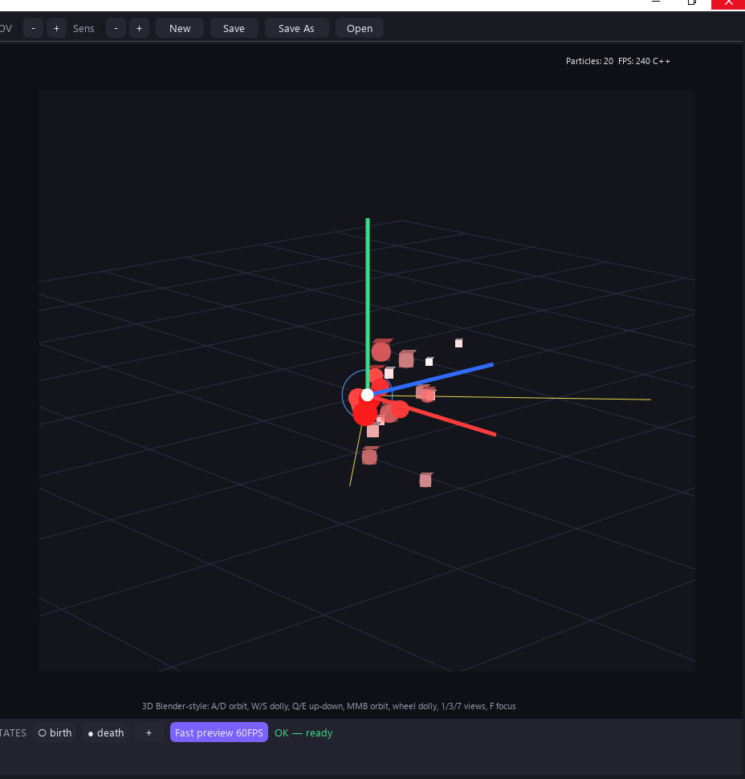

</div>

---

## 📖 Overview

Lempo Particle Editor is a two-part toolkit:

| Part | What it is |
| --- | --- |
| **Lempo Particle Editor** | A Dear PyGui desktop app (`LempoParticleEditor.exe`, entry `editor/studio_imgui.py`) for designing effects with a live viewport, then exporting them as JSON. `editor/particle_studio.py` is the Tk fallback and the shared logic layer (defaults, sim math, validation, migration). |
| **Advanced Particle Emitter** | A GDevelop extension (`AdvancedParticleEmitter.json`) that renders those effects in-game: **2D** via [PixiJS](https://pixijs.com) and **3D** via [Three.js](https://threejs.org). |

Both parts share a single source of truth for particle behavior, shapes, and the export format (see [Shared contracts](#-shared-contracts)), so an effect looks the same in the editor, the browser preview, and your game.

> Works in any GDevelop project — design the effect in the editor, play it in-game with the Advanced Particle Emitter extension.

---

## 🖼️ Screenshots

<table>
  <tr>
    <td align="center"><br><sub><b>3D viewport</b></sub></td>
    <td align="center">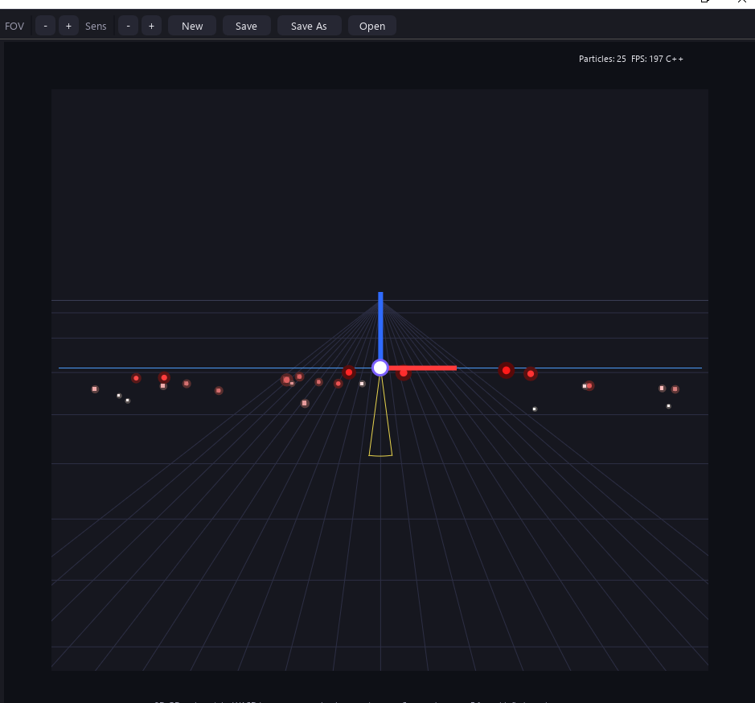<br><sub><b>2D viewport</b></sub></td>
  </tr>
  <tr>
    <td align="center">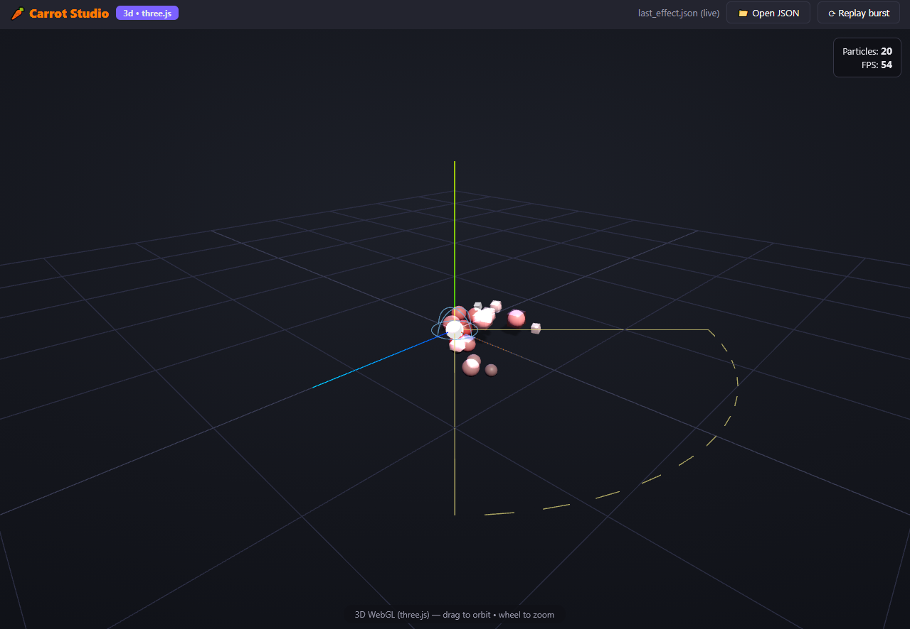<br><sub><b>3D browser fast preview</b></sub></td>
    <td align="center">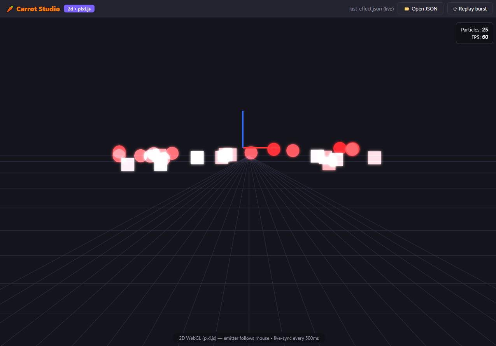<br><sub><b>2D browser fast preview</b></sub></td>
  </tr>
  <tr>
    <td align="center">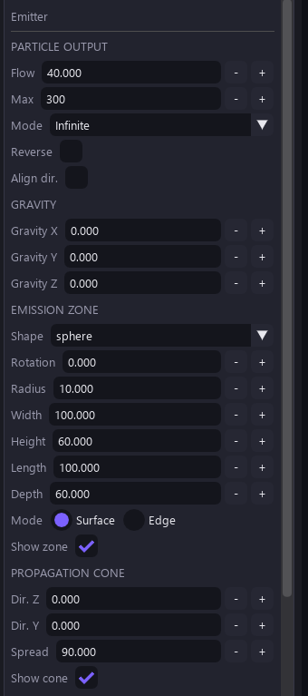<br><sub><b>Emitter panel</b></sub></td>
    <td align="center">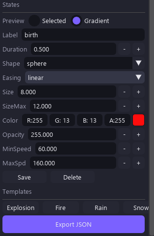<br><sub><b>Per-state colors (3D)</b></sub></td>
  </tr>
</table>

<details>
<summary><b>More screenshots</b></summary>

<table>
  <tr>
    <td align="center">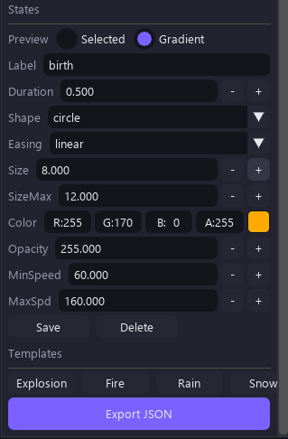<br><sub>States panel (2D)</sub></td>
    <td align="center">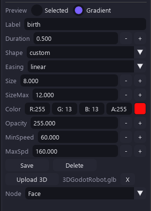<br><sub>Custom shape</sub></td>
  </tr>
  <tr>
    <td align="center">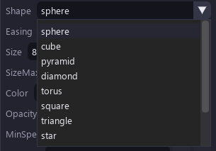<br><sub>3D shapes (1)</sub></td>
    <td align="center">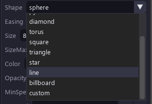<br><sub>3D shapes (2)</sub></td>
  </tr>
  <tr>
    <td align="center" colspan="2">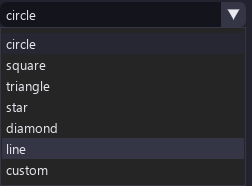<br><sub>2D shapes</sub></td>
  </tr>
</table>

</details>

---

## ✨ Features

### 🎛️ Editor
- **12 particle shapes** — circle, square, triangle, star, diamond, line, custom, sphere, cube, pyramid, torus, billboard — shared by the 2D and 3D renderers.
- **Custom 3D models & images** — upload `.glb` / `.gltf` / `.obj` (or images for 2D). Models render as themselves in the viewport, the browser preview, and in-game. Rigged/skinned GLBs are baked to their rest pose automatically.
- **Per-state colors** — birth / mid / death each keep their own color. White means natural materials; any other color tints over the base.
- **Gradual shape morph** — birth-to-death shapes cross-fade inside the `(0.25, 0.75)` window instead of snapping (desktop viewport + browser preview; game runtime keeps the classic swap for meshes).
- **Ready-made templates** — Explosion, Fire, Rain, Snow (2D + 3D variants), with 100-step undo/redo.
- **Force fields** *(v1.1)* — age-phased turbulence, Y-axis vortex, linear-falloff attractor, and a bounce/friction collision plane. All off by default (legacy motion stays bit-identical). Editable in the Dear PyGui sidebar; Tk preserves the block on round-trip.
- **Deterministic seed** — a nonzero `seed` replays the identical effect everywhere: editor (Python + C++), browser preview, and GDevelop runtime. `0` keeps legacy unseeded behavior. Editable in the Dear PyGui sidebar; Tk preserves it.
- **Blend modes** — Normal, Additive, Subtractive, Multiply, Screen, Lighten, Overlay, selectable per emitter in the Dear PyGui sidebar (Tk preserves the loaded value).
- **Trails & Ribbons modes** — `2D | Trails & Ribbons` (key `4`) and `3D | Trails & Ribbons` (key `5`) in the startup dialog; trail mode renders ribbons only. Unity-style inspector (foldouts Trail / Shape / Color / Texture / Per-Particle / Lighting & Sorting / Tools & Motion) generated from one schema (`TRAIL_SCHEMA`, 79 keys): width/gradient curve editors, tooltips, min/max clamps, drag-labels, steppers, per-section reset + copy/paste, and a template browser (27 ready-made templates across combat / magic / movement / nature / stylized, with search, favorites, and your own saved presets). Curves bake to 64-sample and gradients to 256-entry LUTs on change only; C++ core parses the same tables (parity-tested). **Emit mode**: `time` (legacy — lifetime gates, particle lives then fades) or `distance` (Godot-style — fixed sections × sectionLength, speed-independent, trail dies with the particle; `sectionLength=0` gives every-frame FIFO tick, like Trail2D-addon). Trail mode shows ribbons only (`trails_on()` gate skips dots + raster); particle mode keeps dots + overlay.

### ⚡ Performance
- **InstancedMesh batching (3D primitives)** — ~580 draw calls collapse into ~12 buckets (`INST_CAP 2048`), verified **pixel-identical** per particle (matrix, color, alpha), including morph flips and all blend modes. Models/images keep the pooled-mesh path.
- **Lazy buckets** — `getBucket` creates a bucket on first write per shape; empty buckets stay `visible=false` and cost zero draw calls.
- **Sampling diet** — constant tracks take the static fast path and colors use pre-parsed ints (`F._dietOff` forces the legacy path for A/B) — zero visual change.
- **Pooled runtime** — shape-aware mesh/material pooling, shared geometries, hoisted per-frame temporaries, and no per-frame allocations in steady state. Automatic fallback to the classic path if instancing is unavailable (`F._forceClassic`).
- **Dual simulation core** — a Python reference plus an optional compiled **C++ core** for faster live preview, checked for numerical parity (99/99 cases) against Python.
- **Adaptive viewport** — crisp vector drawlist below ~900 particles (`MIN_N = 900`); above that, the particle layer renders offscreen (320 px wide) and uploads as a texture while guides/gizmo stay vector. Custom meshes always use the vector path.

### 🔍 Previews
- **In-editor GPU preview** — a minimal offscreen OpenGL 3.3 renderer built on raw `ctypes` (no PyOpenGL or numpy needed).
- **Browser fast preview** — a self-contained `live_effect.html` (≈1.1 MB, zero network fetches) rendering the same effect live in Three.js (3D) / PixiJS (2D), with 500 ms live-sync. Trail mode renders ribbons in the preview too (glow + edge + core strips, gradient colors, `time`/`distance` emission) and hides the particle dots, exactly like the editor viewport.
- **OS-native file dialogs** — Save / Export / Open use the OS picker (Dear PyGui dialogs deliver empty payloads on this setup).

### 🎨 Trail templates (adding a new one)
- Drop one JSON file in `assets/presets/trails/<category>/<id>.json` (`category`: `combat|magic|movement|nature|stylized`) — no UI or C++ changes needed. Format: `{ "id", "name", "category", "description", "tags": [], "modes": ["2d","3d"], "settings": {…partial trail fields…}, "overrides_2d": {…}, "overrides_3d": {…}, "texture": "dots|null (closest supported procedural; editor falls back gracefully)", "textureHiFi": "<deferred-runtime G5 id, e.g. slash_streak>", "version": 1, "artNotes": "<one sentence: what it must look like>", "demoMotion": "<reserved parametric path id, player deferred>" }`. Curves are `[[x, y(, mode)]]` key lists, gradients are `[[x, "#rrggbb"(, mode)]]` / `[[x, a(, mode)]]` stop lists; field names and ranges come from `TRAIL_SCHEMA` (unknown fields are ignored, bad values fall back with a warning). Missing fields fall back to schema defaults; applying a template overwrites ONLY trail settings (emitter/states untouched, so HYBRID spark looks come from your live particles via per-particle trails + `inheritColor`).
- C++ API surface (`particle_core`, raw C API): `templates_init(schema, user_dir)`, `templates_register(id, data, is_user)`, `templates_list(category, query, mode, sort, fav_only) -> [ids]`, `templates_info(id)`, `templates_apply(id, mode, defaults, current) -> (settings, changed_ids)`, `templates_thumbnail(id, w, h) -> (w, h, bytes)`, `templates_texture(kind, w, h)`, `templates_fav(id, on)`, `presets_save(name, settings, meta) -> path`, `presets_delete(name)`. Split: C++ owns registry/validation/search/merge/LUT-ready data/thumbnails/textures/preset files; Python (`editor/trail_templates_ui.py`) only builds Dear PyGui widgets, forwards clicks/keys to one core call, and `set_value`s the changed widgets. Measured: scan+validate 27 templates ~5ms, apply ~0.10ms, filter ~0.13ms; thumbnails/textures cached and uploaded once.

---

## 🚀 Quick Start

### 1. Get the editor

Download `LempoParticleEditor.exe` from the **[Releases](https://github.com/Boy1developer/Lempo-Particle-Editor/releases)** page and run it. No Python installation required. The window title shows `v0.2.0`; it pairs with extension `v0.1.2` and export format `v1.1` (v1.0 files migrate automatically).

**Requirements:** Windows 10/11 (64-bit) · GPU with OpenGL 3.3 support

<details>
<summary><b>Run from source / rebuild</b></summary>

```bash
pip install dearpygui
python editor/studio_imgui.py
```

Tk fallback (shared logic layer, no blend/seed/field widgets — values are preserved):

```bash
python editor/particle_studio.py
```

Rebuild the packaged app (compile check → C++ core build if stale → PyInstaller → smoke test → Windows shortcut):

```bash
python tools/rebuild_app.py
```

This produces `dist/LempoParticleEditor.exe` plus the `Lempo Particle Editor` desktop shortcut (both carry the Lempo icon).

> Binaries (`dist/`, `*.exe`, `*.pyd`, `node_modules/`) are never committed. They are rebuilt locally and shipped through GitHub Releases.

</details>

### 2. Use effects in GDevelop

1. **Design** your effect in Lempo Particle Editor and export it as a `.json` file.
2. **Import** `AdvancedParticleEmitter.json` into your GDevelop project as an extension.
3. **Add** the emitter object to your scene and set its **ParticleJSON** resource to the exported file. If the effect uses a custom model, also set the **Models GLB** resource to your `.glb`.
4. **Run** the preview and enjoy your effect in-game.

> Exact action/condition names depend on the extension version — see the extension's in-editor descriptions.

---

## 🎨 Blend Modes

Set per emitter from the sidebar dropdown. At object level, `BlendingMode: 'JSON'` uses each emitter's own mode; any explicit value forces all emitters.

| Mode | 2D (PixiJS) | 3D (Three.js) | Desktop GL preview | Browser preview |
| --- | --- | --- | --- | --- |
| Normal | normal | normal | `SRC_ALPHA, ONE_MINUS_SRC_ALPHA` | normal |
| Additive | add | additive | `SRC_ALPHA, ONE` | add |
| Subtractive | erase ¹ | subtractive | reverse-subtract | erase ¹ |
| Multiply | multiply | multiply | `DST_COLOR, ONE_MINUS_SRC_ALPHA` | multiply |
| Screen | screen | custom (add + `ONE, ONE_MINUS_SRC_COLOR`) | `ONE, ONE_MINUS_SRC_COLOR` | screen |
| Lighten | → Normal ² | custom max-equation | max | → Normal ² |
| Overlay | overlay | → Normal ³ | → Normal ³ | overlay |

<sub>¹ Pixi core has no subtract · ² Pixi core has no lighten · ³ No fixed-function overlay</sub>

Unsupported combinations fall back to Normal with a **single** `console.warn` — never per frame, never throwing. Extension versions before 0.1.2 don't know Screen / Lighten / Overlay and render them as Normal.

---

## 🤝 Shared Contracts

Everything that must stay identical across Python, C++, the browser preview, and the GDevelop extension lives in one place: [`contracts/contracts.json`](contracts/contracts.json) — particle record layout, `SHAPE_ORDER`, easings, blend modes, export schema, and morph window.

[`tools/generate_contracts.py`](tools/generate_contracts.py) regenerates the language bindings in [`contracts/gen/`](contracts/gen/) (Python, C++ header, TypeScript reference, JSON Schema). **Edit the JSON, run the generator, never the outputs.** CI fails on stale files or drifted consumers.

- **Python** (`editor/particle_studio.py`) and the **C++ core** (`core/particle_core.cpp`) import the generated files directly.
- **TypeScript** (`preview/`, `carrots-runtime/`) and the **GDevelop extension** keep literal copies for bundling reasons; the check script verifies they match.

**Export format v1.1** — validated against `contracts/gen/schema.json` on save and load, with hyphenated easing values (`linear` / `ease-in` / `ease-out` / `ease-in-out`). `migrate_effect()` heals old files automatically (missing version, v1.0 → v1.1, camelCase easings, missing blend mode / seed).

**Particle record layout:**

```
[x, y, vx, vy, age, c0, c1, s0, s1, life, z, vz, shape, tracks,
 dx, dy, dz, gx, gy, gz, sizeRatio, speedRatio]
```

---

## 🧪 Testing

CI runs the parity, behavior, and contract checks on every push (`.github/workflows/ci.yml`).

> **Naming note:** the editor UI is built on Dear PyGui, which wraps Dear ImGui — that is why the UI test files are prefixed `test_imgui_`.

<details>
<summary><b>Full test matrix</b></summary>

| Test | Covers |
| --- | --- |
| `core/test_parity.py` | Python vs C++ simulation output — 99/99 passing |
| `core/test_behavior.py` | Simulation behavior, morph-window keys, performance (~2–3 ms @ 2,000 particles) |
| `tests/test_imgui_build.py` | UI builds without errors (blend dropdown, seed box, force-field widgets) |
| `tests/test_imgui_logic.py` | Headless simulation logic (C++ path) |
| `tests/test_imgui_nav.py` | Viewport navigation (WASD/arrows, Q/E, F, Shift×3) + sidebar splitter hover/drag |
| `tests/test_imgui_color.py` | Per-state color persistence across birth/death switches |
| `tests/test_imgui_mesh.py` | Uploaded models render as meshes, tint, culling, LOD |
| `tests/test_imgui_morph.py` | Shape cross-fade window (edges, split alpha, legacy fallback) |
| `tests/test_imgui_upload.py` | Upload chain, OBJ parsing, big-JSON node names, bone-node fallback |
| `tests/test_imgui_raster.py` | Raster path: PPM conversion, GL orientation, auto-switch, no-GL fallback |
| `tests/test_preview_blobs.py` | Model-blob embedding for the browser preview |
| `tests/test_contracts.py` | Generated bindings = source, C++ order, schema accept/reject, migration |
| `tests/test_gl_blend.py` | Pixel-level GL formulas per blend mode + fallbacks |
| `tests/test_blend_modes.py` | Blend round-trip, sanitize, sample layers |
| `tests/test_seed.py` | Seed replay identical (Python + C++), divergence, seed-0 legacy |
| `tests/test_fields.py` | Field formulas, off-identical, perturb/replay, collision, attractor (Py + C++) |
| `preview/test_blend.mjs` | Extension blend mappings + resolution (stubbed runtimes) |
| `preview/test_seed.mjs` | Preview replay identical + extension RNG extraction |
| `preview/test_fields.mjs` | Extension helpers == Python + preview field behavior |
| `preview/test_trails.mjs` | Preview trails: bake parity vs Python (exact), store semantics, engine wiring 2D/3D, style helpers |
| `preview/test_ext_runtime.mjs` | Shipped 3D runtime headless (stub gdjs + real three.js) |
| `preview/test_engine.mjs`, `test_engine3d.mjs`, `test_guides.mjs`, `test_server.py` | Browser preview engine, 2D/3D scene layers, guides |
| `preview/test_models.mjs` | Model-blob caching and live-push behavior |
| `preview/test_morph.mjs` | Preview-side `morphAt()` cross-fade sampling |
| `preview/test_bake.mjs` / `test_ext_bake.mjs` | Skinned-mesh rest-pose baking (preview + shipped extension) |
| `tests/test_trails_schema.py` | `TRAIL_SCHEMA` ↔ defaults sync, clamps, LUT sizes |
| `tests/test_trails_roundtrip.py` | Trail files byte-stable round-trip + old-file heal |
| `tests/test_trails_parity.py` | Python ↔ C++ trail width/gradient/scalars |
| `tests/test_trails_perf.py` | Trail update/bake perf budgets |
| `tests/test_trails_flow.py` | Time/distance emission, exact spacing, tick FIFO, trail death |
| `tests/test_trails_render.py` | Ribbon-strip math + viewport smoke |
| `tests/test_trails_templates.py` | 27 templates load/search/apply, thumbnails, user-preset round-trip |
| `tests/test_view2d_zoom.py` | World-space 2D zoom math, anchors, raster agreement |
| `tools/check_perf.py` | CI perf gate: C++ throughput floor |
| `render/test_gl.py`, `test_clip.py`, `test_cost.py` | GL context init, projection parity, render-cost profiling |

</details>

---

## 🛣️ Roadmap

**Done**
- [x] Ready-made effect templates (Explosion, Fire, Rain, Snow)
- [x] CI for parity and behavior tests
- [x] Screenshots and a step-by-step GDevelop guide
- [x] InstancedMesh batching, lazy buckets, sampling diet *(v0.1.2)*
- [x] Screen / Lighten / Overlay blend modes *(v0.1.2)*
- [x] Deterministic seed + force fields *(v0.1.2)*
- [x] Trails & Ribbons renderer (79-key TRAIL_SCHEMA, 27 templates, Godot-style distance emission, C++ registry + DPG browser)
- [x] Template browser with search, favorites, and user presets + world-space 2D zoom (cursor-anchored wheel, Q/E, drag-label aware)
- [x] Over-life Bézier curves and gradient editor *(part of TRAIL_SCHEMA curve/gradient tables)*
- [x] Instanced rendering parity 99/99, behavior, trails schema/roundtrip/parity/perf/render, imgui build, contracts

**Planned**
- [ ] Flipbook animation, UV scroll, soft particles
- [ ] Effect node tree with parent/child emitters and sub-emitters
- [ ] Timeline with scrubbing and a preset gallery
- [ ] Golden-image tests (editor render vs browser preview)

---

## 👤 Author

**Mostafa Fathy (EG dev)** — independent developer ([@Boy1developer](https://github.com/Boy1developer)).

🎬 YouTube: [youtube.com/@EG_dev](https://www.youtube.com/@EG_dev)

## 📦 Third-Party

| Library | License | Used for |
| --- | --- | --- |
| [Dear PyGui](https://github.com/hoffstadt/DearPyGui) | MIT | Desktop editor UI |
| [Three.js](https://threejs.org) | MIT | 3D rendering (browser preview + GDevelop extension) |
| [PixiJS](https://pixijs.com) | MIT | 2D rendering (browser preview + GDevelop extension) |

## 📄 License

Released under the [MIT License](LICENSE).

<div align="center">

<br>

Made by **Mostafa Fathy (EG dev)** · [🎬 YouTube](https://www.youtube.com/@EG_dev) · If this helps your game, consider giving it a ⭐

</div>
